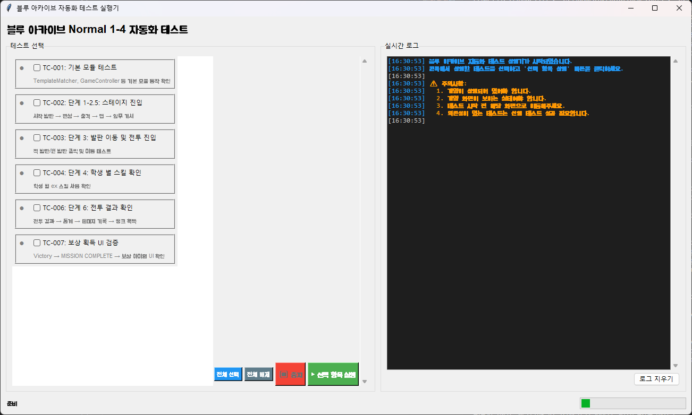
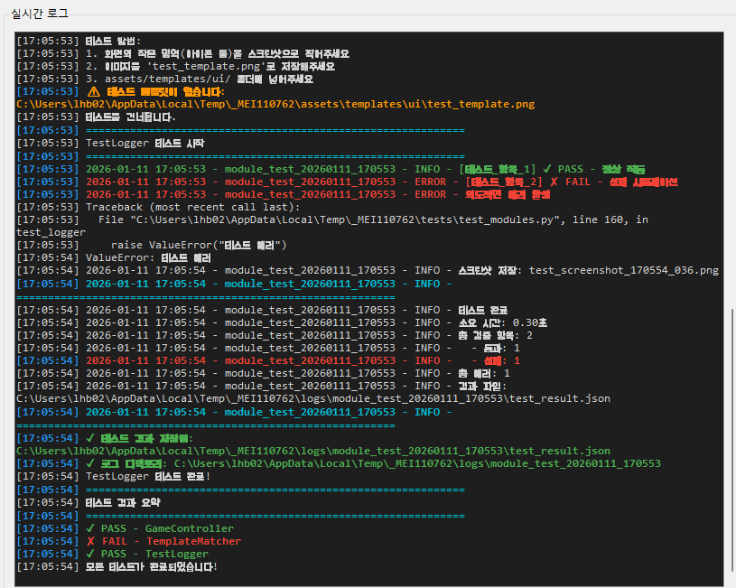
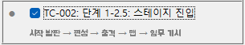
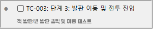
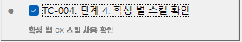
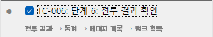
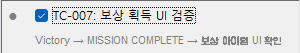

# 블루 아카이브 자동화 테스트 사용 가이드

본 문서는 `gui_test_runner.py`를 기준으로 각 테스트 케이스가 **실제 게임 화면(GUI)** 에서 어떤 흐름으로 동작하며, 사용자가 무엇을 준비하고 어떤 결과를 확인해야 하는지를 설명합니다.

---

## 공통 실행 환경

- 해상도: **2560x1440 (필수)**
- 실행 대상: **Live 빌드 클라이언트**
- 입력 방식: 마우스 / 키보드 자동 입력
- 검증 방식: 템플릿 매칭 기반 화면 인식

⚠️ 해상도, UI 스케일, 창 모드 변경 시 테스트 실패 가능

---

## 테스트 실행 방법

```bash
BlueArchiveAutoTest.exe 실행
```

- 테스트는 원하는 테스트를 선택하여 실행합니다
- 여러 테스트를 선택하여 실행할 수 있으나 대기 시간 싱크가 맞지 않아 권하지 않습니다.
- 실패 발생 시 해당 TC에서 즉시 중단됩니다 (Fail Fast)
- 각 단계별 스크린샷 및 로그 자동 저장됩니다

---

## TC-001: 기본 모듈 테스트
### 테스트 대상
   1. GameController - 마우스/키보드 제어
   2. TemplateMatcher - 이미지 인식
   3. TestLogger - 결과 로깅

---

## TC-002: 스테이지 진입

### GUI 동작 흐름
   1. 시작 발판 클릭
   2. 편성 화면 전환
   3. 출격 버튼 클릭
   4. 스테이지 맵으로 돌아오는지 확인
   5. 임무 개시 버튼 클릭

### 사용자 확인 포인트
- 스테이지 첫 진입 후 해당 테스트 실행 종료 시 부대 편성이 완료되는지
- 임무 개시 버튼이 클릭 되어 스테이지가 시작되는지
---


---

## TC-003: 발판 이동 및 전투 진입

### GUI 동작 흐름
1. 이동 가능한 발판 클릭
2. 적이 있는 발판이었을 시 전투 진입
3. 비어있는 발판이었을 시 Phase 종료
4. 전투 UI 요소 탐색
   - 하단 전투 UI
   - 스테이지 정보 UI
   - 일시정지 버튼

### 사용자 확인 포인트
- 이동 가능한 발판으로 이동하는지
- 적이 있는 발판이었을 시 전투 화면으로 전환되는지
- 비어있는 발판이었을 시 Phase 종료되는지

---

## TC-003: 각 학생별 EX 스킬 사용 여부

### GUI 동작 흐름
1. 전투 시작 후 대기
2. EX 스킬 슬롯 1~3 순차 접근
3. 스킬 버튼을 화면 중앙으로 드래그
4. 사용된 스킬 버튼이 사라졌는지 확인

### 사용자 확인 포인트
- 스킬 버튼이 실제로 드래그되는지
- 사용된 스킬 버튼이 사라졌는지

⚠️ 스킬 발동 성공 여부, 이펙트, 데미지는 검증하지 않습니다

---

## TC-005: 각 전투별 학생 데미지 기록

### GUI 동작 흐름
1. 전투 종료 (전투 결과 화면)
2. 결과 화면에서 통계 버튼 클릭
3. 데미지 리포트 창 대기
4. 학생 아이콘 템플릿 탐색 (최대 6명)

### 사용자 확인 포인트
- 데미지 리포트 UI가 정상적으로 열리는지
- 전투에 참가한 학생 아이콘이 매핑되어 있는지

⚠️ 데미지 수치, 그래프, 순위는 검증 대상이 아닙니다

---

## TC-006: 보상 획득 UI 검증

### GUI 동작 흐름
0. 마지막 보스 전투 이후에 실행되어야 합니다.
1. 전투 결과 화면 확인
2. 전투 결과 확인 버튼 클릭
3. MISSION COMPLETE 화면 대기
4. 확인 버튼 클릭
5. 보상 아이템 UI 탐색
   - 크레딧 아이콘
   - 활동 보고서 아이콘

### 사용자 확인 포인트
- 보상 화면이 정상적으로 표시되는지
- 보상 아이템 카드 UI가 존재하는지

⚠️ 인벤토리 반영 여부, 수량 증가는 검증하지 않습니다

---

## 테스트 실패 시 체크리스트

- 해상도가 2560x1440 인지 확인
- UI 스케일 변경 여부 확인
- 게임 언어 설정 변경 여부 확인
- 템플릿 이미지 최신화 여부 확인

---

본 자동화는 **"보인다 / 안 보인다" 수준의 GUI 검증**에 최적화되어 있으며,
게임 내부 상태나 수치 검증은 범위에서 제외됩니다.

